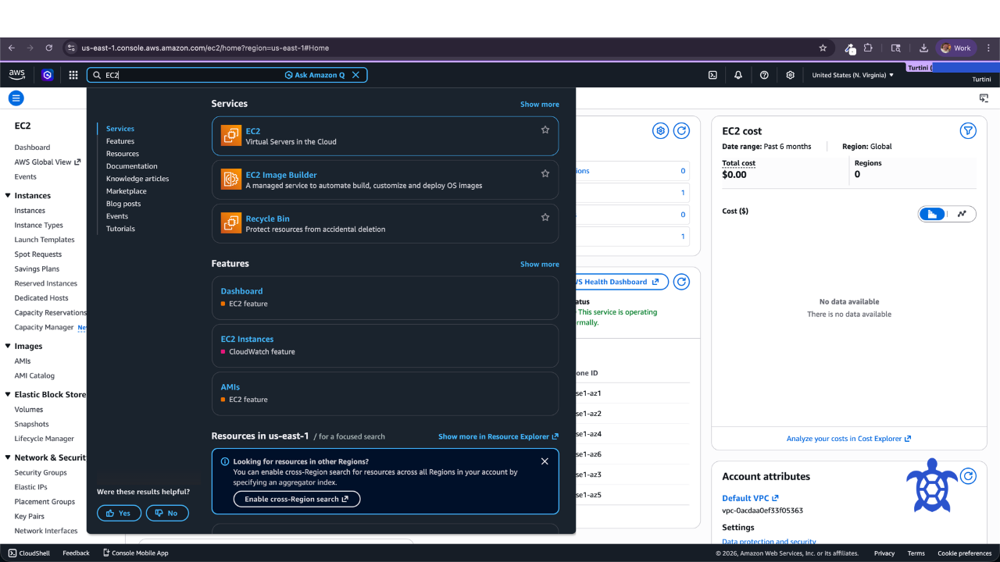
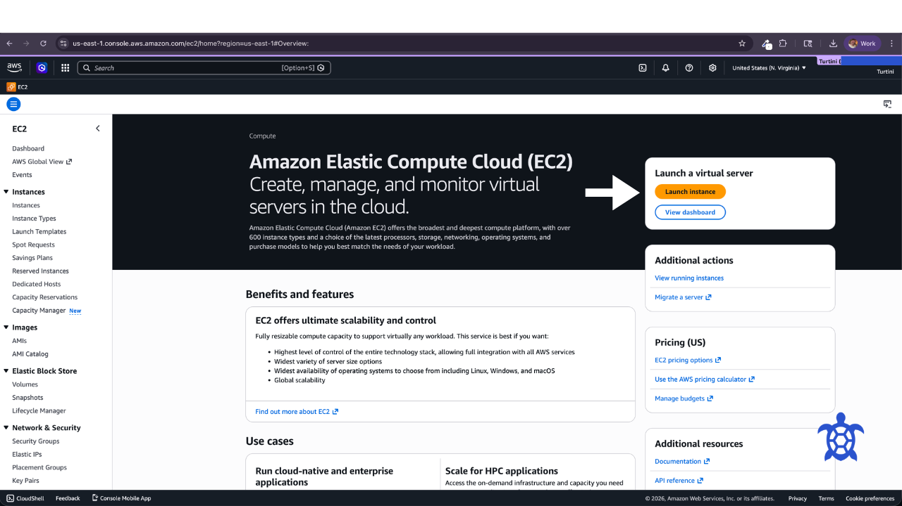
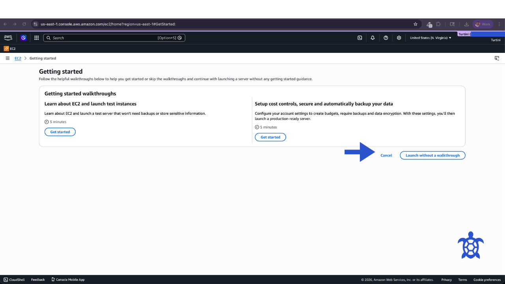
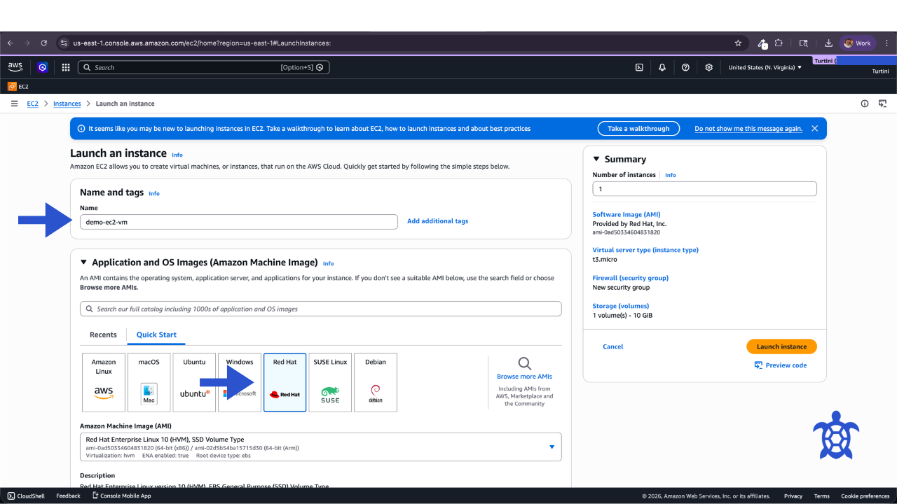
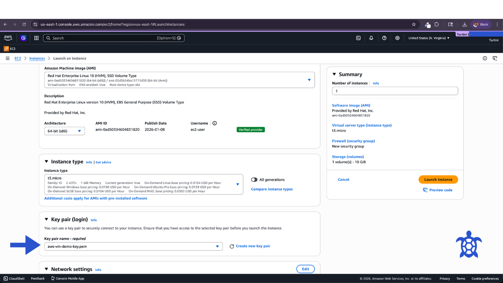
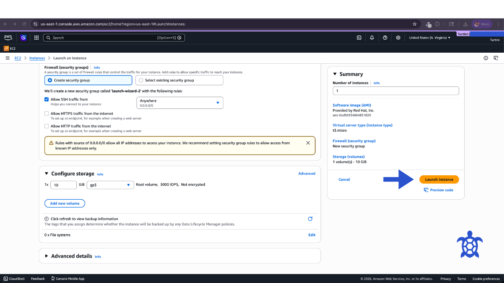
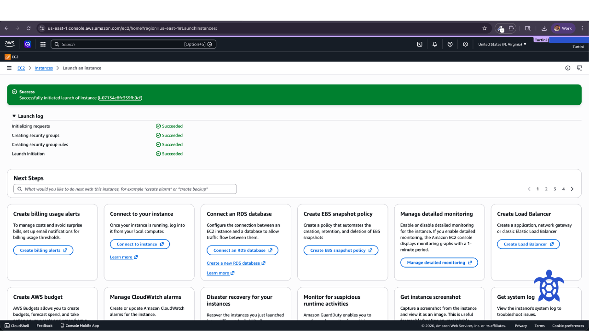
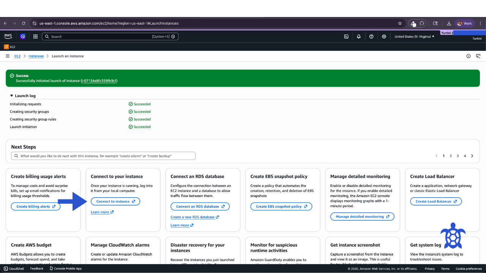
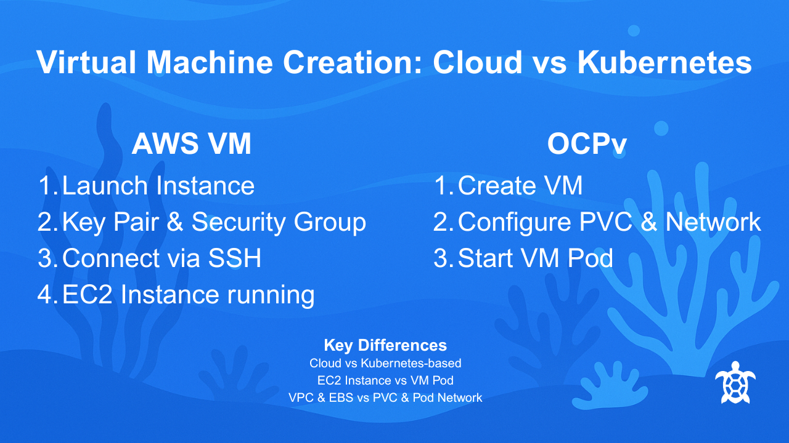

# AWS EC2 VM Creation Demo

This guide walks through the process of creating a virtual machine (EC2 instance) in Amazon Web Services.

The demo is designed for learning and training purposes and shows the basic workflow used by engineers to launch a virtual machine in AWS.

It is part of the **Turtini Training Loop**, a series of short operational guides focused on building practical infrastructure skills.

---

## Overview

In this demo we will:

1. Log into the AWS Console
2. Navigate to the EC2 service
3. Launch a new virtual machine
4. Configure networking and access
5. Connect to the instance
6. Verify the VM is operational

Estimated time: **10–15 minutes**

---

## Architecture Overview

The virtual machine will run inside a Virtual Private Cloud (VPC) and be accessible via SSH.

```
User
  │
  ▼
AWS Console
  │
  ▼
EC2 Service
  │
  ▼
Virtual Machine (EC2 Instance)
  │
  ▼
Security Group + Networking
```

---

## Step 1 — Log into AWS

1. Open the AWS Console at https://console.aws.amazon.com
2. Sign in with your AWS account credentials
3. From the **Services** menu select **EC2** or in the search bar type:

```
EC2
```
4. Click EC2



You should now see the EC2 dashboard.

---

## Step 2 — Launch a New Instance

1. Click **Launch Instance**



2. Click **Launch without a wakthrough**



3. Provide a name for the instance

Example:

```
demo-ec2-vm
```

4. Select **Red Hat** under Application and OS Images (Amazon Machine Image) or AMI.



---

## Step 3 — Choose Instance Type

Select a small instance type for the demo.

Example:

```
t2.micro
```

This instance type is commonly included in the AWS free tier.

---

## Step 4 — Configure Access

Create or select an SSH key pair.

Name:

```
aws-vm-demo-key.pem
```

Key type:

```
RSA
```

Format:

```
.pem
```

Download and store this key securely.



---

## Step 5 — Configure Networking

Use the default VPC settings for the demo.

Recommended settings:

*Create security group
* Allow SSH traffic from anywhere
* 1 x10 GiB gp3 Root volume, 3000 IOPS, Not encrypted

This creates the necessary **security group rules** to allow access to the VM.

The default storage settings are fine:

```
10 GiB pg3
```

---

## Step 6 — Launch the Instance

Click **Launch Instance**.

AWS will begin provisioning the virtual machine.

Provisioning typically takes **30–60 seconds**.





---

## Step 7 — Connect to the VM

From the EC2 dashboard:

1. Click **Connect to your instance**



3. Use either:

   * EC2 Instance Connect
   * SSH from your terminal

Example SSH command:

```
ssh -i aws-vm-demo-key.pem ec2-user@INSTANCE_PUBLIC_IP
```

Example:

```
ssh -i aws-vm-demo-key.pem ec2-user@54.191.10.25
```

---

## Step 8 — Verify the VM

Once connected, run:

```
uname -a
```

This confirms the virtual machine is running and accessible.

Review your OS information by running:

```
cat /etc/os-release
```

## Step 9 — Stop or Terminate your VM

To avoid charges, from the AWS Console, access the EC2 dashboard again.

1. Open the AWS Console at https://console.aws.amazon.com
2. Sign in with your AWS account credentials
3. From the **Services** menu select **EC2** or in the search bar type:

```
EC2
```
4. Click EC2

You should now see the EC2 dashboard.

5. Select **Instances**

6. Select **Instant State** and select Stop or Terminate. This stops or terminates the VM.


---

## Demo Complete

You have successfully:

* Created a virtual machine in AWS
* Configured networking and access
* Connected to the instance
* Completed housekeeping after you ran your demo



---

## Related Demo

The companion guide shows how to create a VM using [**OpenShift Virtualization**](https://docs.turtini.com/projects/openshift-vm-demo/en/latest/README.html).

This demonstrates the difference between:

* Public cloud infrastructure
* Virtual machines running inside Kubernetes

---

## About Turtini

Turtini builds operational platforms that make open source delivery seamless for federal teams.

Learn more:

[https://turtini.com](https://turtini.com)
